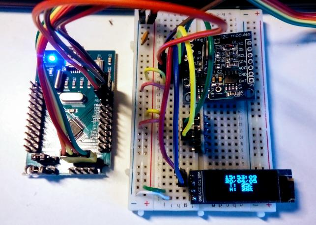

## simple "weather station"

Uses BME280 sensor for temperature and humidity reading, 
DS1307 RTC for time and date, and SSD1306 OLED as display. 

Shared-bus is used to share the I2C between the three devices.

Requires patched bme280 driver, otherwise will not compile with the STM32Fxx crate

Patch consists of removing the I2c Read trait, otherwise the compiler will return the following error: 

76 |             let measurements = bme280.measure().unwrap();
   |                                       ^^^^^^^ method not found in `bme280::BME280<shared_bus::BusProxy<'_, cortex_m::interrupt::Mutex<core::cell::RefCell<hal::i2c::I2c<hal::stm32::I2C1, hal::gpio::gpiob::PB8<hal::gpio::Alternate<hal::gpio::AF1>>, hal::gpio::gpiob::PB7<hal::gpio::Alternate<hal::gpio::AF1>>>>>, hal::i2c::I2c<hal::stm32::I2C1, hal::gpio::gpiob::PB8<hal::gpio::Alternate<hal::gpio::AF1>>, hal::gpio::gpiob::PB7<hal::gpio::Alternate<hal::gpio::AF1>>>>, hal::delay::Delay>`
   |
   = note: the method `measure` exists but the following trait bounds were not satisfied:
           `shared_bus::BusProxy<'_, cortex_m::interrupt::Mutex<core::cell::RefCell<hal::i2c::I2c<hal::stm32::I2C1, hal::gpio::gpiob::PB8<hal::gpio::Alternate<hal::gpio::AF1>>, hal::gpio::gpiob::PB7<hal::gpio::Alternate<hal::gpio::AF1>>>>>, hal::i2c::I2c<hal::stm32::I2C1, hal::gpio::gpiob::PB8<hal::gpio::Alternate<hal::gpio::AF1>>, hal::gpio::gpiob::PB7<hal::gpio::Alternate<hal::gpio::AF1>>>> : hal::prelude::_embedded_hal_blocking_i2c_Read`

Currently will not fit into memory on STM32F030 board.

TO DO:

* add decimal points and better formatting
* add pressure reading
* try to make code smaller to fit on STM32F030
* propose a PR with the patch